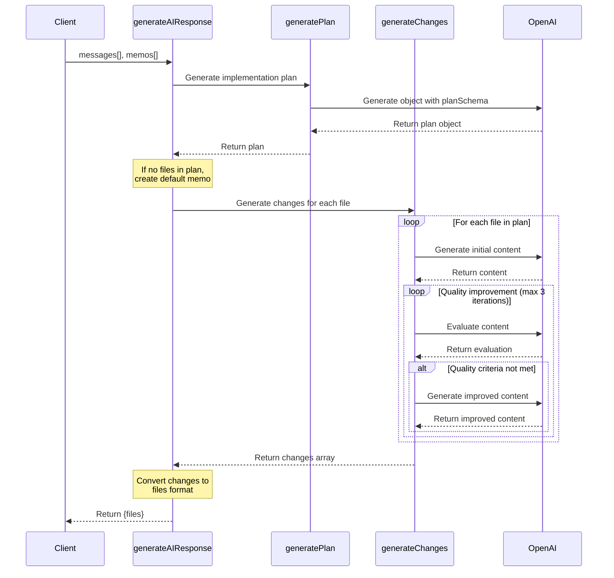

# memos

mem**os** stems from the word "memo" which is short for memorandum and OS which is short for operating system. The goal of memos is to create an operating system for your mind.

The goal of this project is to let users talk freely about their thoughts and ideas with AI agents that then organize their thoughts and ideas into a coherent structure.

The kernel of the mem**os** are readable, editable and interconnected Markdown files with a twist, they can contain actions too.

The UI is inspired by Teenage Engineering's products.

ADD IMAGES HERE

## Tech Stack

- Next.js
- Tailwind CSS
- Shadcn UI
- ElevenLabs Conversational AI
- AIM
- Vercel AI SDK

### AIM

AIM is a language [microchipgnu](https://x.com/microchipgnu) created. It is an AI-enhaced markup language inspired by Markdown and Markdoc. 

### Core Agent

At the end of a session, the user shares their current memos state with the core agent which in turn analyzes everything and then creates a new state.

#### Generates a plan

#### Executes the plan
#### Shares the new state




---


This is a [Next.js](https://nextjs.org) project bootstrapped with [`create-next-app`](https://nextjs.org/docs/app/api-reference/cli/create-next-app).

## Getting Started

First, run the development server:

```bash
npm run dev
# or
yarn dev
# or
pnpm dev
# or
bun dev
```

Open [http://localhost:3000](http://localhost:3000) with your browser to see the result.

You can start editing the page by modifying `app/page.tsx`. The page auto-updates as you edit the file.

This project uses [`next/font`](https://nextjs.org/docs/app/building-your-application/optimizing/fonts) to automatically optimize and load [Geist](https://vercel.com/font), a new font family for Vercel.

## Learn More

To learn more about Next.js, take a look at the following resources:

- [Next.js Documentation](https://nextjs.org/docs) - learn about Next.js features and API.
- [Learn Next.js](https://nextjs.org/learn) - an interactive Next.js tutorial.

You can check out [the Next.js GitHub repository](https://github.com/vercel/next.js) - your feedback and contributions are welcome!

## Deploy on Vercel

The easiest way to deploy your Next.js app is to use the [Vercel Platform](https://vercel.com/new?utm_medium=default-template&filter=next.js&utm_source=create-next-app&utm_campaign=create-next-app-readme) from the creators of Next.js.

Check out our [Next.js deployment documentation](https://nextjs.org/docs/app/building-your-application/deploying) for more details.
